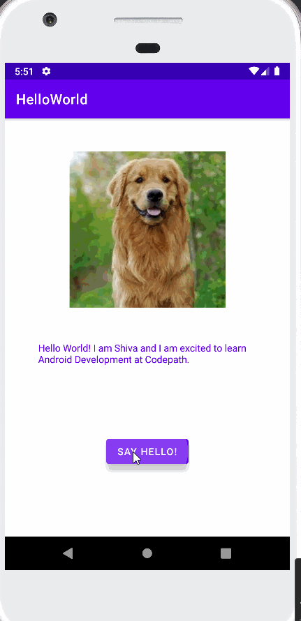

# Android Prework - *Hello World!*

Submitted by: **Shiva Acharya**

**Hello World!** is an android app that shows an image and introductory message, and allows pressing a button to display a Toast. 

Time spent: **3** hours spent in total

## Required Features

The following **required** functionality is completed:

* [x] Image and introductory message displayed on screen
* [x] Button displayed on screen
* [x] Toast with message appears when button is pressed 

The following **optional** features are implemented:

* [ ] List anything else that you can get done to improve the app functionality!

## Video Walkthrough

Here's a walkthrough of implemented features:

<!-- Replace this with whatever GIF tool you used! -->
GIF created with [LiceCap](http://www.cockos.com/licecap/).  
<!-- Other options include:
[Kap](https://getkap.co/) for macOS
[ScreenToGif](https://www.screentogif.com/) for Windows
[peek](https://github.com/phw/peek) for Linux. -->

## Notes

Describe any challenges encountered while building the app.

## License

    Copyright [2022] [Shiva Acharya]

